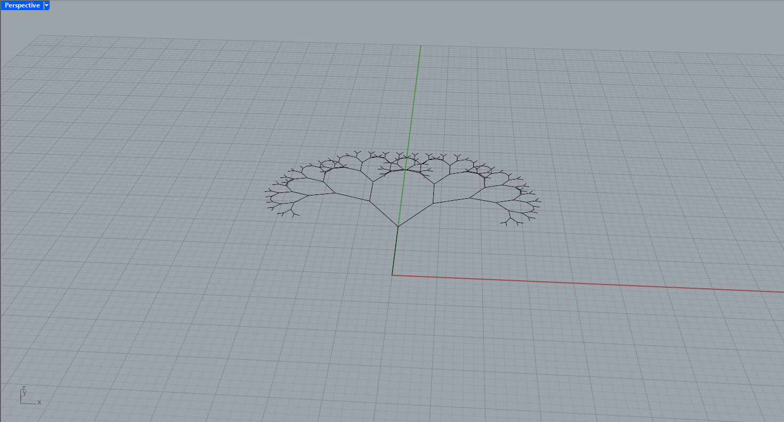
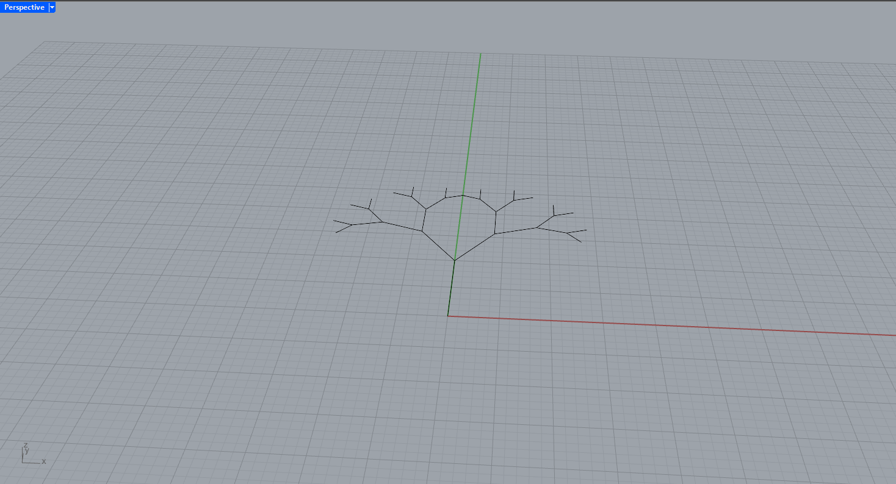
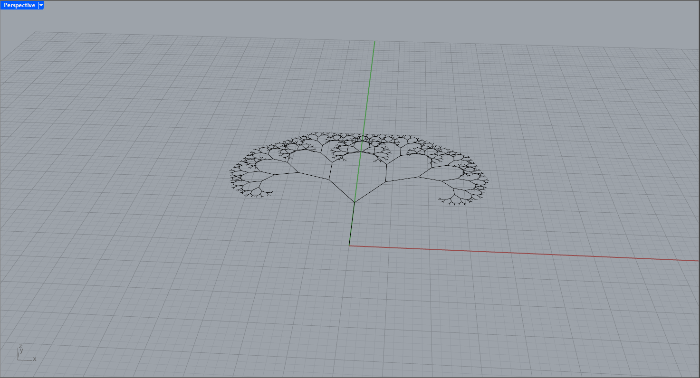

### Update this every week to show report

# **Andrei Vince** for Week 2
- Implemented voxel limit enforcement (`max_voxels_per_tower = 400`) with early stopping
- Integrated seed-based randomness for reproducibility
- Created a rule-based prompt classification system:
  - Describes tower forms based on structure (exemple: "tapered", "fragmented")
- Generated clean prompt strings for each tower:

2D_CA_tower, fragmented form, b=2, s=2–6, 25 layers

### Prompt Classification Logic

| Condition                                      | Label        |
| --------------------------------------------- | ------------ |
| Survive min ≤ 2 and survive max ≥ 6           | fragmented   |
| Layers ≥ 25 and birth ≥ 3                     | tapered      |
| Voxel count ≥ 380                             | dense        |
| Layers ≥ 20 and voxel count < 300             | eroded       |
| Otherwise                                     | mixed        |

### Example Generated Prompt

2D_CA_tower, tapered form, b=3, s=2–5, 30 layers

### Example Visual


# **Aidan** for Week 2
<<<<<<< HEAD

- Implemented a recursive Python script (`branchingTree.py`) in Rhino to generate a branching tree structure
- Used `rhinoscriptsyntax` to construct bifurcating branches using vector rotation and scaling
- Introduced parameters for angle, depth, and scaling ratio to control the fractal-like tree generation
- Explored variations in recursion depth to visualize structural complexity

### Example Visual




### Example Script Snippet


```python
def draw_branch(start_point, direction, length, angle, depth):
    if depth == 0:
        return

    end_point = rs.PointAdd(start_point, rs.VectorScale(direction, length))
    rs.AddLine(start_point, end_point)

    vec1 = rs.VectorRotate(direction, angle, [0, 0, 1])
    vec2 = rs.VectorRotate(direction, -angle, [0, 0, 1])

    draw_branch(end_point, vec1, length * 0.7, angle, depth - 1)
    draw_branch(end_point, vec2, length * 0.7, angle, depth - 1)


=======
>>>>>>> ff7b1e69a90fcfeeee82417789ed9da2f68afbba
