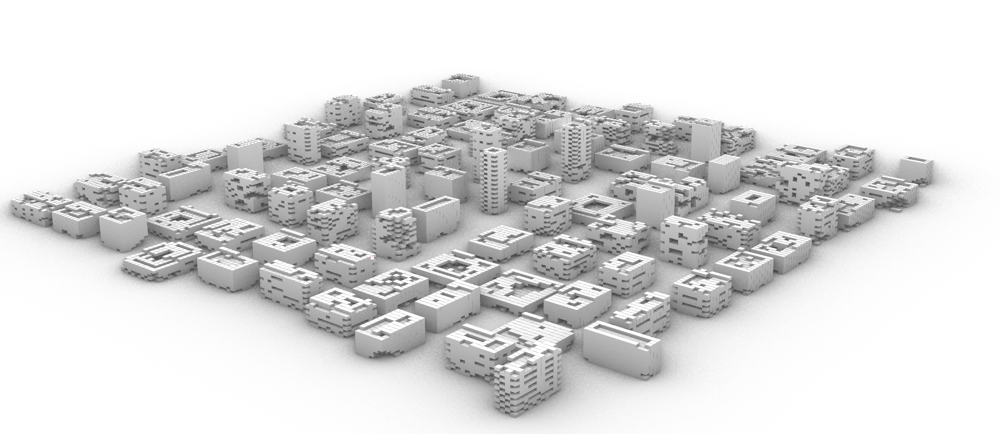

### Update this every week to show report

# **Andrei Vince** for Week 2
- Implemented voxel limit enforcement (`max_voxels_per_tower = 400`) with early stopping
- Integrated seed-based randomness for reproducibility
- Created a rule-based prompt classification system:
  - Describes tower forms based on structure (exemple: "tapered", "fragmented")
- Generated clean prompt strings for each tower:

2D_CA_tower, fragmented form, b=2, s=2–6, 25 layers

### Prompt Classification Logic

| Condition                                      | Label        |
| --------------------------------------------- | ------------ |
| Survive min ≤ 2 and survive max ≥ 6           | fragmented   |
| Layers ≥ 25 and birth ≥ 3                     | tapered      |
| Voxel count ≥ 380                             | dense        |
| Layers ≥ 20 and voxel count < 300             | eroded       |
| Otherwise                                     | mixed        |

### Example Generated Prompt

2D_CA_tower, tapered form, b=3, s=2–5, 30 layers

### Example Visual


# **Aidan** for Week 2
<<<<<<< HEAD

- Implemented a recursive Python script (`branchingTree.py`) in Rhino to generate a branching tree structure
- Used `rhinoscriptsyntax` to construct bifurcating branches using vector rotation and scaling
- Introduced parameters for angle, depth, and scaling ratio to control the fractal-like tree generation
- Explored variations in recursion depth to visualize structural complexity

### Example Visual


### Example Script Snippet


```python
def draw_branch(start_point, direction, length, angle, depth):
    if depth == 0:
        return

    end_point = rs.PointAdd(start_point, rs.VectorScale(direction, length))
    rs.AddLine(start_point, end_point)

    vec1 = rs.VectorRotate(direction, angle, [0, 0, 1])
    vec2 = rs.VectorRotate(direction, -angle, [0, 0, 1])

    draw_branch(end_point, vec1, length * 0.7, angle, depth - 1)
    draw_branch(end_point, vec2, length * 0.7, angle, depth - 1)


=======
>>>>>>> ff7b1e69a90fcfeeee82417789ed9da2f68afbba
```

# **Andrei Vince – Week 3 Update**

### ✅ Summary of Progress

- Introduced **deterministic seed locking per index** (`random.seed(42 + idx)`) to ensure reproducibility across runs.
  - ATTENTION: If you want full randomness again, you should **comment out the seed line** in the script.
- Preserved rule-based **shape classification** (e.g., "tapered", "dense"), though it now plays a **secondary role** in the pipeline.
- Automated **image capture** of each generated tower outputs are saved with consistent naming for future prompt alignment.
- Injected **manually curated prompts** for the first 10 towers to bootstrap prompt-to-form mapping.

---

### 🧠 Prompt Classification Logic

| Rule                                               | Label        |
| -------------------------------------------------- | ------------ |
| `survive_min ≤ 2` and `survive_max ≥ 6`            | fragmented   |
| `layers ≥ 25` and `birth ≥ 3`                      | tapered      |
| `voxel_count ≥ 380`                                | dense        |
| `layers ≥ 20` and `voxel_count < 300`              | eroded       |
| *(otherwise)*                                      | mixed        |

---

### ⚠️ Challenges Faced

- Rhino’s rendering camera had to be re-centered manually per tower to get usable screenshots
- Workaround using `rs.Command("-_ViewCaptureToFile")` was used for Camera

---

### 🚀 Next Steps

- Build an **external file** to store structured metadata (index, CA params, visual traits, manual prompt)
- Begin **prompt generalization** phase use GPT-based embedding comparison to expand curated prompts to remaining 90 towers
- Later: explore model fine-tuning or retrieval-based LLM prompting for consistent generative descriptions




---


